## 一、文档信息

| 项目名称 | 海上全域感知大屏 |
|---------|----------------|
| 文档版本 | V1.0 |
| 编制日期 | 2026-08-04 |
| 编制人 | - |
| 审核人 | - |
| 批准人 | - |
| 客户单位 | - |
| 编制单位 | AgentPM |
| 适用范围 | 海上监管值班监控场景下的 PC 端独立全屏大屏 |
| 核心目标 | 以海图态势为视觉主体，贯通目标监控、筛选、详情查看、告警处置联动与视图工具，内置演示数据驱动完整链路 |
| 文档状态 | 草稿 |

**历史版本**

| 版本 | 日期 | 作者 | 更改说明 |
|-----|------|------|---------|
| V1.0 | 2026-08-04 | - | 初始版本 |

---

## 二、项目概述

### 2.1 项目背景

海上监管业务依托 AIS、雷达、北斗等多源感知手段掌握辖区船舶动态，现有能力可覆盖目标融合、光电联动、轨迹分析、电子围栏等方向，但距离"值班盯得清、处置找得快"的目标仍有差距。当前业务面临以下问题：

1. **多源数据分散**：AIS、雷达、北斗各自独立呈现，值班人员需要反复切换才能判断同一目标的多源状态，重点目标容易漏看。
2. **信息过载**：海图目标数量大、要素多，缺乏按来源、状态、类型的快速过滤手段，无法在短时间内聚焦关注对象。
3. **告警处置链路长**：告警事件分散展示，从发现告警到定位关联目标、查看详情、发起处置的路径较长，影响值班效率。
4. **交互与视觉陈旧**：原有大屏信息架构复杂、视觉风格老化，面板层级深，难以满足高频盯屏和演示汇报双重需求。
5. **数据验证困难**：真实数据接入前缺少可完整跑通核心链路的演示数据环境，功能验证和效果展示成本高。

为解决上述问题，本次在独立工程中重建海上全域感知大屏，保留原系统核心业务能力，重构信息架构、交互路径与视觉体系，并以内置演示数据驱动完整链路，为后续接入真实数据源提供基础。

### 2.2 项目建设目标

本项目旨在建设一套面向值班监控场景的海上全域感知大屏，实现以下目标：

1. **全域态势一屏统览**：以海图态势为视觉主体，集中展示融合目标、目标状态、来源分布与告警事件，值班人员无需切换页面即可掌握辖区整体态势。
2. **多源目标状态可视**：AIS、雷达、北斗三源融合目标统一呈现，在线、离线、异常状态清晰区分，单源上报时效与数据质量可查。
3. **值班处置高效闭环**：从筛选目标、查看详情到告警定位、发起处置的路径均可在同一大屏内完成，关键操作不超过三步触达。
4. **视觉与交互体验升级**：在保留核心能力的基础上重新设计科技感视觉体系与信息架构，面板层级扁平、信息密度合理，兼顾高频操作与演示观感。
5. **数据与架构可演进**：内置演示数据完整驱动目标、轨迹、告警、视图联动，数据层与界面解耦，后续可平滑替换为真实数据接入。

### 2.3 项目建设范围

本项目建设范围包括：

**系统端**：
- PC 端独立全屏大屏（Web 应用），按 1920×1080 设计稿等比缩放，窗口比例不符时双轴适配并居中。

**功能模块**：
- 地图态势层：海图底图、图层管理、融合目标渲染、缩放聚合、悬浮提示、点击定位、平移缩放。
- 目标监控：目标列表、多维筛选、数量统计、列表联动定位。
- 目标详情：基本信息、实时动态、来源融合、轨迹概览、快捷操作。
- 告警事件：告警滚动、告警列表与详情、地图联动、告警处置。
- 工具栏：图层切换、目标样式、复位视角、坐标拾取、测距、全屏。

**数据范围**：
- 内置演示数据：融合目标、单源上报、轨迹点、告警事件，按固定周期模拟目标移动、来源上报与告警新增。
- 演示数据结构与真实接入结构保持一致，后续替换数据接入方式时界面与交互不做调整。

**不包含的功能**：
- 用户登录与权限管理（预留角色权限设计基线，后续迭代接入）。
- 光电联动控制、电子围栏配置编辑（原系统能力，v1.0 不在范围内）。
- 真实海图底图服务与真实 AIS/雷达/北斗数据接入（预留接入位置，后续迭代实现）。
- 移动端与多端适配。

### 2.4 业务流程图

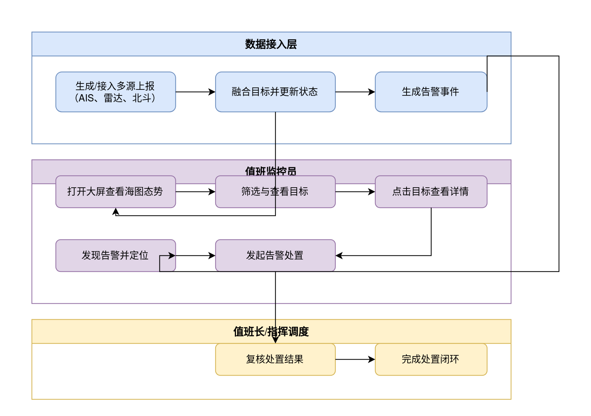

### 2.5 业务角色定义

| 角色名称 | 角色描述 | 主要职责 | 权限范围 |
|---------|---------|---------|---------|
| 值班监控员 | 大屏日常盯屏与操作人员 | 查看海图态势、筛选监控目标、查看目标详情、查看告警并发起处置 | 全部大屏功能 |
| 值班长 | 值班班组负责人 | 复核告警处置结果、监督值班情况、协调处置 | 全部大屏功能、处置复核 |
| 指挥调度人员 | 应急指挥与调度岗位 | 查看全域态势、定位重点目标、研判告警 | 查看态势、目标详情、告警定位 |
| 系统管理员 | 系统维护人员 | 维护演示数据、检查数据刷新状态、处理展示异常 | 全部大屏功能、数据维护 |

---

## 三、项目建设内容

### 3.1 总体功能架构

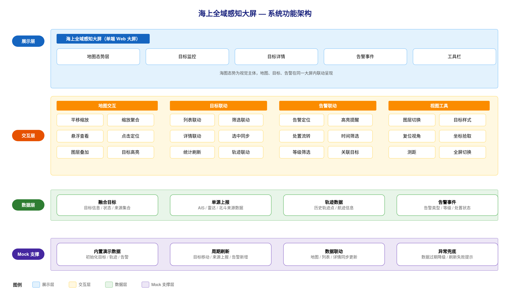

海上全域感知大屏为单端 PC 大屏应用，以海图态势为视觉主体，按以下功能模块组织：

- 地图态势层（一级菜单）
  - 海图底图（二级模块）：海洋底图、网格纹理、行政区划、雷达覆盖范围等图层叠加展示。
  - 融合目标渲染（二级模块）：AIS、雷达、北斗三源融合目标统一绘制，按目标状态区分标记。
  - 缩放聚合（二级模块）：地图缩放时目标自动聚合或散开，聚合点展示目标数量。
  - 地图交互（二级模块）：平移、缩放、悬浮查看、点击定位。
- 目标监控（一级菜单）
  - 目标列表（二级模块）：分页展示融合目标，支持点击联动定位。
  - 多维筛选（二级模块）：按数据来源、目标状态、目标类型、关键词筛选。
  - 数量统计（二级模块）：展示目标总数、各来源数量、告警数量。
- 目标详情（一级菜单）
  - 基本信息（二级模块）：船名、MMSI、呼号、类型、国籍、尺寸、吃水。
  - 实时动态（二级模块）：经纬度、航速、航向、更新时间、目标状态。
  - 来源融合（二级模块）：AIS、雷达、北斗各来源最近上报时间与数据质量。
  - 轨迹概览（二级模块）：最近轨迹折线与关键航迹点。
  - 快捷操作（二级模块）：定位、跟踪、查看轨迹、告警处置入口。
- 告警事件（一级菜单）
  - 告警滚动（二级模块）：最新告警按时间流滚动展示。
  - 告警列表与详情（二级模块）：按等级、时间查看告警及详情。
  - 地图联动（二级模块）：点击告警定位关联目标并高亮。
  - 告警处置（二级模块）：待处置、处置中、已处置状态流转。
- 工具栏（一级菜单）
  - 图层切换（二级模块）：目标、轨迹、行政区划、雷达覆盖图层显示与隐藏。
  - 目标样式（二级模块）：目标标记大小、轨迹尾迹显示调整。
  - 视图工具（二级模块）：复位视角、坐标拾取、测距。
  - 全屏切换（二级模块）：大屏全屏与退出全屏。

### 3.2 需求功能清单

| 序号 | 业务需求 | 需求概述 | 优先级 |
|-----|---------|---------|-------|
| 1 | 海图态势展示 | 以海图为视觉主体展示辖区海洋环境，集中呈现融合目标、目标状态与告警事件，支撑全域态势一屏统览 | P0 |
| 2 | 多源目标融合 | 统一展示 AIS、雷达、北斗三源融合目标，目标类型与状态清晰可辨，多源上报信息可查 | P0 |
| 3 | 目标快速筛选 | 按数据来源、目标状态、目标类型、关键词筛选目标，快速聚焦关注对象 | P0 |
| 4 | 目标详情查看 | 查看目标基本信息、实时动态、来源融合与轨迹概览，支撑值班研判与处置决策 | P0 |
| 5 | 告警事件监控 | 实时感知告警事件，按等级与时间查看告警详情，定位告警关联目标 | P0 |
| 6 | 告警处置流转 | 对待处置告警发起处置并跟踪处置状态，支持值班长复核处置结果 | P1 |
| 7 | 视图辅助工具 | 提供复位视角、坐标拾取、测距等辅助能力，支撑地图研判 | P1 |
| 8 | 演示数据支撑 | 内置演示数据完整驱动目标、轨迹、告警联动链路，支持周期刷新与异常兜底 | P1 |
| 9 | 大屏显示适配 | 支持大屏分辨率等比缩放适配，窗口比例变化时内容完整可见、布局稳定 | P1 |

### 3.3 页面功能清单

| 终端 | 一级菜单 | 二级菜单 | 子功能 | 功能描述 |
|-----|---------|---------|-------|---------|
| PC端 | 地图态势层 | 海图底图 | 图层叠加 | 查看海洋底图、网格纹理、行政区划、雷达覆盖等图层叠加效果 |
| ^ | ^ | ^ | 图层开关 | 按需显示或隐藏目标、轨迹、行政区划、雷达覆盖图层 |
| ^ | ^ | 融合目标渲染 | 目标展示 | 查看 AIS、雷达、北斗三源融合目标，按类型与状态识别目标 |
| ^ | ^ | 缩放聚合 | 聚合展示 | 缩放地图时查看目标自动聚合或散开，聚合处查看目标数量 |
| ^ | ^ | 地图交互 | 平移缩放 | 平移、缩放海图查看辖区各区域态势 |
| ^ | ^ | ^ | 悬浮查看 | 悬停目标查看名称、MMSI、航速、航向等关键信息 |
| ^ | ^ | ^ | 点击定位 | 点击地图目标定位并查看目标详情 |
| ^ | 目标监控 | 目标列表 | 列表查看 | 分页查看目标名称、MMSI、航速、航向、数据来源、状态 |
| ^ | ^ | 多维筛选 | 筛选目标 | 按数据来源、目标状态、目标类型、关键词筛选目标 |
| ^ | ^ | 数量统计 | 统计查看 | 查看目标总数、各来源数量、告警数量 |
| ^ | ^ | 列表联动 | 联动定位 | 点击列表项定位地图目标并查看目标详情 |
| ^ | 目标详情 | 基本信息 | 信息查看 | 查看船名、MMSI、呼号、类型、国籍、尺寸、吃水 |
| ^ | ^ | 实时动态 | 动态查看 | 查看经纬度、航速、航向、更新时间、目标状态 |
| ^ | ^ | 来源融合 | 来源查看 | 查看 AIS、雷达、北斗各来源最近上报时间与数据质量 |
| ^ | ^ | 轨迹概览 | 轨迹查看 | 查看目标最近轨迹与关键航迹点 |
| ^ | ^ | 快捷操作 | 快捷操作 | 执行定位、跟踪、查看轨迹、告警处置入口操作 |
| ^ | 告警事件 | 告警滚动 | 滚动展示 | 按时间流查看最新告警 |
| ^ | ^ | 告警列表与详情 | 列表查看 | 按等级、时间查看告警列表 |
| ^ | ^ | ^ | 详情查看 | 查看告警类型、等级、目标信息、发生时间、处置状态 |
| ^ | ^ | 地图联动 | 联动定位 | 点击告警定位关联目标并高亮 |
| ^ | ^ | 告警处置 | 处置操作 | 对待处置告警发起处置并流转处置状态 |
| ^ | ^ | ^ | 处置复核 | 对已处置告警进行复核 |
| ^ | 工具栏 | 图层切换 | 图层切换 | 显示或隐藏目标、轨迹、行政区划、雷达覆盖图层 |
| ^ | ^ | 目标样式 | 样式调整 | 调整目标标记大小、轨迹尾迹显示 |
| ^ | ^ | 视图工具 | 复位视角 | 一键恢复默认海图视角 |
| ^ | ^ | ^ | 坐标拾取 | 点击地图拾取经纬度 |
| ^ | ^ | ^ | 测距 | 在地图上测量距离 |
| ^ | ^ | 全屏切换 | 全屏切换 | 切换大屏全屏展示与退出全屏 |

### 3.4 页面访问权限

本项目 v1.0 不包含用户登录与权限管理，以下矩阵仅定义各业务角色的权限基线，用于后续迭代接入权限体系时的设计依据。

| 功能模块 | 值班监控员 | 值班长 | 指挥调度人员 | 系统管理员 |
|---------|-----------|-------|-------------|-----------|
| 地图态势层 | 全部功能 | 全部功能 | 查看态势 | 全部功能 |
| 目标监控 | 全部功能 | 全部功能 | 查看态势 | 全部功能 |
| 目标详情 | 全部功能 | 全部功能 | 查看详情 | 全部功能 |
| 告警事件 | 全部功能 | 全部功能、处置复核 | 查看告警 | 全部功能 |
| 工具栏 | 全部功能 | 全部功能 | 不涉及 | 全部功能 |
| 演示数据维护 | 不涉及 | 不涉及 | 不涉及 | 维护 |

### 3.5.1 地图态势层

**（一）功能需求概述**

地图态势层是值班监控的视觉主体，用于集中呈现辖区海图环境、融合目标分布与状态变化。值班人员通过本层完成图层查看、目标定位与基础地图操作，为后续目标监控、目标详情与告警定位提供统一的地图上下文。

**（二）功能设计**

**海图底图**

海图底图以海洋环境为背景，叠加网格纹理、行政区划与雷达覆盖范围等图层，展示辖区基础地理与感知覆盖信息。

| 图层名称 | 显示内容 | 默认状态 |
|---------|---------|---------|
| 海洋底图 | 辖区海洋区域与岸线轮廓 | 显示 |
| 网格纹理 | 辖区经纬网格参考线 | 显示 |
| 行政区划 | 辖区行政区划边界与名称 | 显示 |
| 雷达覆盖范围 | 雷达探测覆盖区域 | 隐藏 |

**业务规则**

- 打开大屏时按默认状态加载全部图层，之后保持值班人员最近一次的图层设置。切换图层后，海图内容即时更新。
- 目标图层隐藏时，海图不展示任何目标标记，但目标监控的数量统计与列表仍按完整数据展示，提示"目标图层已隐藏，统计与列表不受影响"。

**融合目标渲染**

海图按数据来源与目标状态区分展示 AIS、雷达、北斗三源融合目标，同一目标合并为一个标记，避免重复展示。

| 展示信息 | 类型 | 说明 |
|---------|------|------|
| 目标名称 | 文本 | 展示目标船名或编号 |
| MMSI | 文本 | 展示目标海上移动通信标识 |
| 目标类型 | 文本 | 货船、渔船、客船、危险品船、其他 |
| 目标状态 | 状态标识 | 在线、离线、异常 |
| 数据来源 | 文本 | AIS、雷达、北斗及组合来源 |

**业务规则**

- 同一目标同时存在多个来源上报时，合并展示为一个标记，并在来源信息中并列展示各来源最近上报时间与数据质量。
- 目标状态按最近一次上报时间与数据质量综合判断：有近期有效上报为在线，超时未上报为离线，数据异常为异常。

**缩放聚合**

地图缩放过程中，目标标记按当前视野与目标密度自动聚合或散开。目标密集时，聚合标记展示目标数量；放大到一定级别后，聚合标记散开为单个目标。

**业务规则**

- 视野内目标数量达到聚合阈值时，多个目标合并为一个聚合标记，并展示目标数量。
- 点击聚合标记后，地图向该区域放大一级；连续放大至散开级别后，展示单个目标标记。

**边界与异常**

- 当前视野无目标时，海图仅展示底图与图层信息，不显示空聚合标记。
- 单源数据缺失或上报时间超时，目标按离线或异常状态展示，并保留最近一次已知位置，提示"该目标数据已超时，显示最近位置"。
- 聚合计算后未定位到任何目标时，海图保持当前视角不变，不产生额外提示。

**地图交互**

支持对海图进行平移、缩放、悬浮查看与点击定位。

**业务规则**

- 悬浮目标标记时，显示目标名称、MMSI、航速、航向四项关键信息；移开后提示消失。
- 点击目标标记时，地图定位该目标，并联动打开目标详情查看。
- 点击海图空白区域时，取消当前选中目标，已打开的目标详情同步收起。

**边界与异常**

- 平移、缩放过程中不打断目标筛选与告警展示，操作结束后恢复目标显示。
- 点击目标时目标已离线或位置缺失，仍定位到最近已知位置并查看详情，提示"目标暂无最新位置，已定位至最近位置"。

**（三）业务逻辑关联**

- 海图底图与图层配置来源于演示数据层，图层显示状态变化后，影响目标监控的目标数量统计与海图目标分布展示。
- 地图目标定位结果被目标监控、目标详情与告警事件复用，任一模块点击目标均触发同一地图定位行为。
- 目标状态与来源信息由演示数据层周期刷新，刷新后海图目标标记同步更新。

**（四）用户操作流程图**

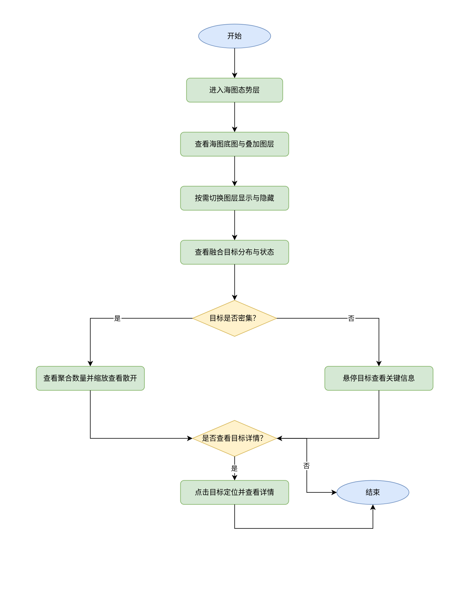

**（五）功能时序图**

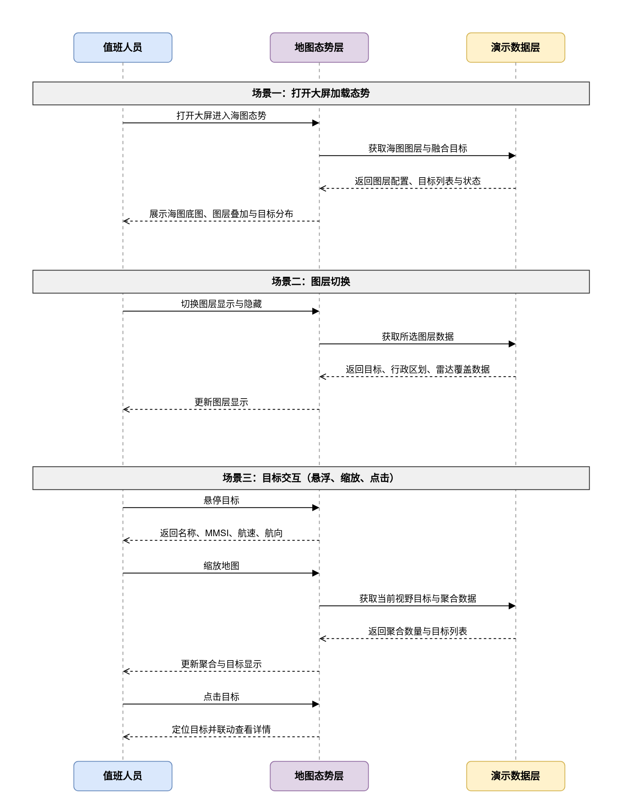

### 3.5.2 目标监控

**（一）功能需求概述**

目标监控用于集中查看辖区全部海上目标的实时状态，通过列表、筛选与数量统计帮助值班人员快速发现关注目标。列表与海图双向联动，值班人员可在同一操作路径内完成目标筛选、定位与详情查看。

**（二）功能设计**

**目标列表**

目标列表展示演示数据层中的融合目标数据，支持分页查看，为值班人员提供海图之外的结构化目标信息。

| 列名 | 字段类型 | 说明 |
|-----|---------|------|
| 目标名称 | 文本 | 展示目标船名或目标编号，无值时显示"-" |
| MMSI | 文本 | 展示海上移动通信标识，无值时显示"-" |
| 航速 | 数值 | 单位节，保留一位小数 |
| 航向 | 数值 | 单位度，保留一位小数 |
| 数据来源 | 来源组合 | AIS、雷达、北斗，多来源并列展示 |
| 目标状态 | 状态标识 | 在线、离线、异常 |
| 更新时间 | 文本 | 展示目标最近一次有效上报时间 |

**业务规则**

- 列表按更新时间倒序排列，演示数据刷新后列表顺序与航速、航向、状态同步更新。
- 分页默认每页展示10条，支持切换每页数量为20条或50条；切换后从第一页开始展示。
- 筛选条件变更后，分页回到第一页，列表展示符合全部筛选条件的目标。
- 点击列表项后，海图定位该目标，目标详情查看同步打开，当前列表项保持选中状态。
- 自动刷新期间，不打断当前选中、已翻页位置与已滚动区域；数据变化仅更新对应条目内容。
- 目标状态与海图目标标记状态保持一致，同一目标在列表与海图中显示相同状态。

**边界与异常**

- **空数据**：当前筛选条件下无目标时，列表显示"暂无符合条件的海上目标"。
- **目标被移除**：演示数据中目标被移除后，列表移除该目标；若该目标正处于选中状态，取消选中并关闭详情，提示"目标已离线或已移除"。
- **更新时间缺失**：无有效上报时间时，更新时间显示"-"。

**多维筛选**

支持按数据来源、目标状态、目标类型与关键词组合筛选目标，筛选条件之间为"与"关系，同组条件内为"或"关系。

| 筛选字段 | 类型 | 说明 |
|---------|------|------|
| 数据来源 | 多选 | 可选项：AIS、雷达、北斗，不选择视为全部来源 |
| 目标状态 | 多选 | 可选项：在线、离线、异常，不选择视为全部状态 |
| 目标类型 | 多选 | 可选项：货船、渔船、客船、危险品船、其他 |
| 关键词 | 文本输入 | 支持按目标名称、MMSI、目标编号模糊查找，自动去除首尾空格 |

**业务规则**

- 任一筛选条件变更后即时生效，无需额外确认；同时满足全部已选条件的目标进入结果集。
- 未选择任何来源、状态与类型时，展示全部目标；仅填写关键词时，按关键词结果展示。
- 关键词支持中文、英文与数字，匹配时忽略大小写。
- 筛选结果同步影响目标列表、数量统计与海图目标标记；筛选结果为空时，海图保留全部目标标记，列表展示空态提示。
- 已选条件支持逐个移除；全部条件清空后恢复默认完整目标集。

**边界与异常**

- **关键词无匹配**：列表显示"暂无符合条件的海上目标"，海图目标不响应点击定位。
- **筛选条件冲突**：同时选择互斥条件导致无结果时，不自动调整其他条件，由值班人员自行修改。
- **演示数据为空**：筛选区保持可用，列表与统计均显示空态。

**数量统计**

数量统计展示当前筛选结果下的目标规模，便于值班人员掌握辖区态势与告警负荷。

| 统计指标 | 说明 |
|---------|------|
| 目标总数 | 当前筛选条件下符合条件的目标数量 |
| 来源数量 | 分别统计包含 AIS、雷达、北斗来源的目标数量 |
| 告警数量 | 当前筛选目标中关联未处置告警的目标数量 |

**业务规则**

- 目标总数、来源数量与告警数量随筛选条件变更和演示数据刷新实时更新。
- 多来源目标同时计入多个来源数量，来源数量合计可大于目标总数。
- 告警数量来源于告警事件中状态为待处置且关联目标处于当前筛选结果内的记录。
- 统计数值变化时以当前最新数据为准，不保留历史累计值。

**边界与异常**

- **演示数据刷新失败**：保留最近一次有效统计数据，并提示"数据刷新失败，正在使用最近数据"。
- **告警数据缺失**：告警数量显示为0，不阻断其他统计展示。

**列表联动**

列表联动用于打通列表、海图与目标详情之间的选中关系，保证值班人员在不同信息入口之间切换时状态一致。

**业务规则**

- 点击列表项后，海图定位至该目标当前位置，目标详情查看展示该目标完整信息，列表项保持选中。
- 点击海图目标标记后，列表同步选中对应目标，目标详情查看同步打开。
- 列表与海图先后选中不同目标时，以最后一次操作为准，前一次选中状态自动取消。
- 联动定位不改变当前筛选条件与分页位置。
- 用户正在查看目标详情时，演示数据刷新不覆盖当前选中目标，仅更新其动态信息。

**边界与异常**

- **目标位置缺失**：点击列表项后定位至目标最近已知位置，并提示"目标暂无最新位置，已定位至最近位置"。
- **目标已离线**：仍允许点击查看与定位，详情中展示离线状态及最近有效数据。
- **联动失败**：海图暂未加载目标数据时，列表项不可点击，并提示"海图数据加载中，请稍后重试"。

**（三）业务逻辑关联**

- 目标列表、筛选选项与数量统计的数据来源于演示数据层，需先保证融合目标数据已加载。
- 本模块选中的目标标识被目标详情与告警事件复用，列表联动与地图定位共享同一目标选中关系。
- 本模块的筛选条件变更后，影响海图目标标记的展示范围，以及告警事件中关联目标的候选结果。
- 告警数量统计依赖告警事件提供待处置告警记录，告警事件无数据时该指标显示为0。

**（四）用户操作流程图**

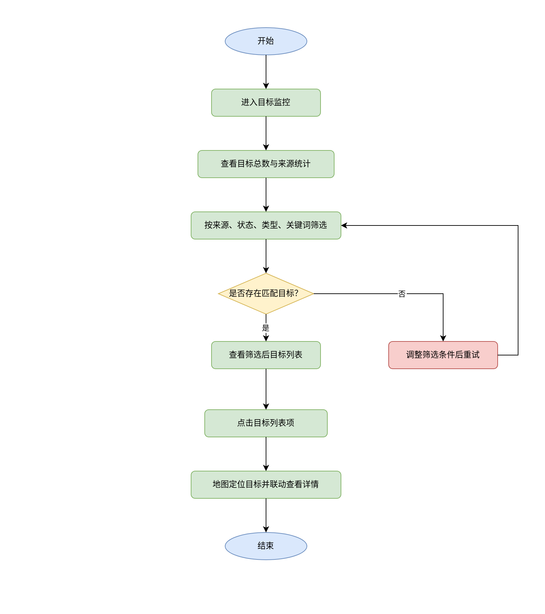

**（五）功能时序图**

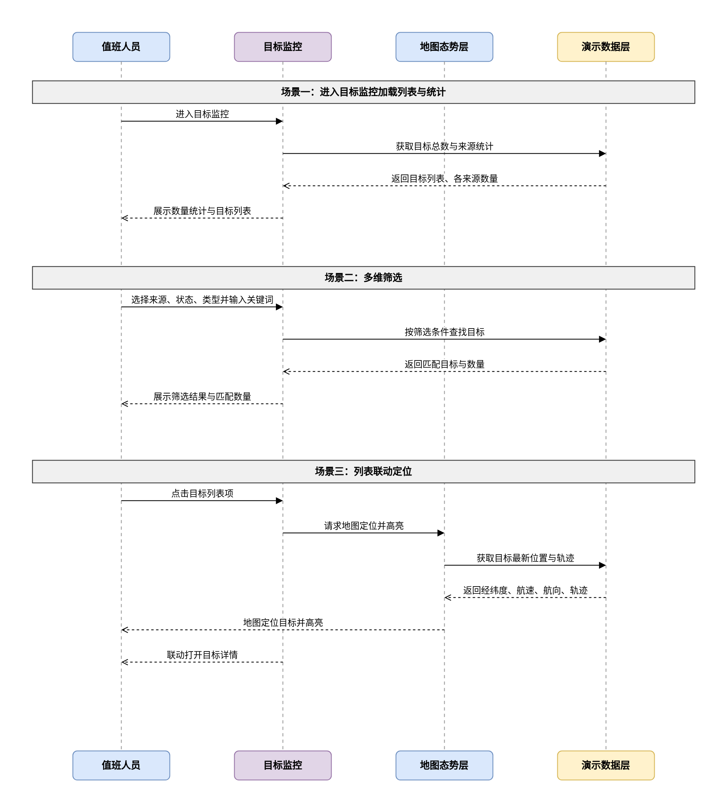

### 3.5.3 目标详情

**（一）功能需求概述**

目标详情用于展示当前选中目标的完整信息，覆盖基本属性、实时动态、多源融合状态与轨迹概览，并为定位、跟踪、告警处置等值班操作提供统一入口。目标详情随目标监控、海图点击与告警联动共用同一目标选中关系，保证各模块查看的是同一目标。

**（二）功能设计**

**基本信息**

基本信息展示目标的静态档案信息，用于值班人员快速识别目标身份。

| 信息项 | 说明 |
|-------|------|
| 船名 | 目标名称，演示数据中与列表保持一致 |
| MMSI | 海上移动通信标识 |
| 呼号 | 目标通信呼号 |
| 类型 | 货船、渔船、客船、危险品船、其他 |
| 国籍 | 目标所属国家或地区 |
| 尺寸 | 目标船长与船宽 |
| 吃水 | 目标当前吃水深度 |

**业务规则**

- 基本信息来源于融合目标的档案字段，目标选中后立即展示，不随演示数据周期刷新而闪动。
- 档案字段缺失时展示"暂无数据"，不阻断其他信息展示。
- 基本信息中的 MMSI 与目标列表、海图悬浮提示保持一致，同一目标在各模块中唯一。

**实时动态**

实时动态展示目标最近一次上报的航行状态，用于判断目标当前态势。

| 信息项 | 说明 |
|-------|------|
| 经纬度 | 目标当前位置坐标 |
| 航速 | 目标当前航速 |
| 航向 | 目标当前航向 |
| 更新时间 | 最近一次有效上报时间 |
| 目标状态 | 在线、离线、异常 |

**业务规则**

- 演示数据按固定周期刷新后，实时动态同步更新，刷新过程中保留最近一次有效值。
- 目标状态为离线或异常时，展示最近有效动态并提示"目标数据已超时，显示最近上报信息"。
- 经纬度变化时，海图目标标记位置同步移动，不改变详情中已选目标。

**来源融合**

来源融合并列展示 AIS、雷达、北斗三个来源对当前目标的最近上报情况，用于判断多源一致性与数据可信度。

| 数据来源 | 展示内容 |
|---------|---------|
| AIS | 最近上报时间、数据质量 |
| 雷达 | 最近上报时间、数据质量 |
| 北斗 | 最近上报时间、数据质量 |

**业务规则**

- 三个来源并列展示，任一来源无上报记录时展示"无上报"。
- 数据质量按高、中、低三级展示，来源于演示数据层设定的质量值。
- 同一来源数据超时后，保留最近一次上报时间并展示超时提示。

**轨迹概览**

轨迹概览以折线方式展示目标最近轨迹，并标注关键航迹点，支撑航向变化与活动范围研判。

| 展示内容 | 说明 |
|---------|------|
| 轨迹折线 | 按时间顺序连接最近轨迹点 |
| 关键航迹点 | 标注时间、位置、航速、航向 |
| 轨迹时间范围 | 展示轨迹起止时间 |

**业务规则**

- 轨迹概览最多展示最近 60 个轨迹点，超出部分不展示。
- 轨迹点按时间升序连接，缺失点位使用相邻点位连线，并提示"轨迹存在数据缺失"。
- 轨迹点不足 2 个时，展示"轨迹数据不足"提示，不绘制折线。

**边界与异常**

- 目标已离线时，轨迹概览展示最近一次有效轨迹，并标注离线时间。
- 轨迹数据刷新失败时，保留最近一次轨迹并提示"轨迹刷新失败，正在使用最近数据"。
- 目标位置缺失时，基本信息与动态正常展示，轨迹与定位展示"暂无位置信息"。

**快捷操作**

快捷操作提供定位、跟踪、查看轨迹与告警处置入口，缩短值班人员从查看详情到后续操作的路径。

| 操作 | 说明 |
|-----|------|
| 定位 | 海图居中定位并高亮当前目标 |
| 跟踪 | 目标移动时保持海图视野跟随 |
| 查看轨迹 | 切换到轨迹概览并突出最近轨迹 |
| 告警处置 | 打开当前目标关联的待处置告警 |

**业务规则**

- 点击定位后，海图视角移动至目标当前位置，目标标记保持高亮。
- 点击跟踪后，演示数据刷新导致目标位置变化时，海图视野自动跟随目标，再次点击取消跟踪。
- 点击告警处置时，仅展示当前目标关联的待处置告警；无关联告警时提示"该目标暂无关联告警"。
- 快捷操作不改变目标详情当前展示内容，仅触发对应联动行为。

**边界与异常**

- 目标位置缺失时点击定位，定位至最近已知位置并提示"目标暂无最新位置，已定位至最近位置"。
- 告警处置入口操作失败时，保留目标详情状态，并提示"告警信息加载失败，请稍后重试"。

**（三）业务逻辑关联**

- 目标详情接收目标监控、海图点击与告警事件传入的目标标识，三者共用同一选中目标。
- 基本信息、实时动态、来源融合与轨迹概览均由演示数据层按目标标识提供，刷新后详情内容同步更新。
- 快捷操作中的定位、跟踪与告警处置分别联动地图态势层与告警事件，联动结果反馈至当前目标详情。

**（四）用户操作流程图**

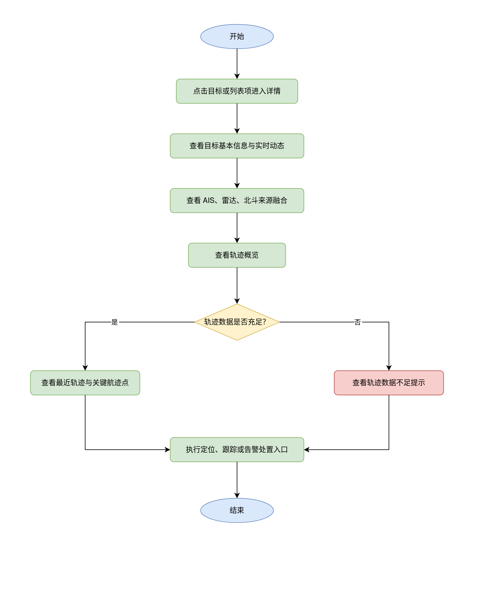

**（五）功能时序图**

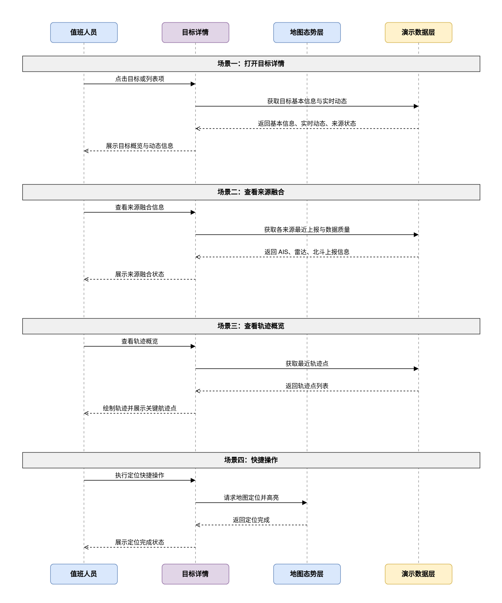

### 3.5.4 告警事件

**（一）功能需求概述**

告警事件用于集中呈现辖区最新告警，支持按等级与时间查看告警列表和详情，并通过地图定位关联目标，贯通从发现告警到处置复核的完整链路。告警事件与目标详情共享目标选中关系，保证告警定位后可直接进入目标研判。

**（二）功能设计**

**告警滚动**

告警滚动区按时间流展示最新告警，保证值班人员在不切换信息层级的情况下掌握最新异常。

| 展示内容 | 说明 |
|---------|------|
| 告警等级 | 紧急、重要、一般 |
| 告警类型 | 越界、超速、失联、碰撞风险、区域告警 |
| 目标名称 | 关联目标名称 |
| 发生时间 | 告警发生时间 |

**业务规则**

- 告警按发生时间倒序排列，新告警自动置顶并高亮展示。
- 告警滚动区最多展示最近 20 条告警，超出部分进入告警列表查看。
- 点击滚动项后，海图定位关联目标，并同步打开该告警详情。

**边界与异常**

- 演示数据无新增告警时，滚动区保留最近告警并提示"暂无新增告警"。
- 告警等级数据缺失时，按一般等级展示，不阻断告警查看。

**告警列表与详情**

告警列表按等级、时间展示全部告警记录，告警详情展示单条告警的完整信息与处置状态。

| 信息项 | 说明 |
|-------|------|
| 告警类型 | 越界、超速、失联、碰撞风险、区域告警 |
| 告警等级 | 紧急、重要、一般 |
| 目标信息 | 关联目标名称、MMSI |
| 发生时间 | 告警发生时间 |
| 处置状态 | 待处置、处置中、已处置、已复核 |

**业务规则**

- 告警列表支持按告警等级筛选，筛选结果按发生时间倒序排列。
- 点击告警记录查看告警详情，详情展示告警类型、等级、目标信息、发生时间与处置状态。
- 处置状态为已复核的告警仍可查看，但不可再次发起处置。

**边界与异常**

- 筛选结果为空时，列表展示"暂无符合条件的告警"。
- 告警关联目标已离线时，详情正常展示，地图定位至最近已知位置并提示。

**地图联动**

告警事件与海图联动，点击告警后在地图上定位并高亮关联目标，辅助值班人员快速确认告警位置。

**业务规则**

- 点击告警后，海图视角移动至关联目标位置，目标标记高亮，其他目标保持原展示状态。
- 告警详情中点击目标信息，进入该目标的目标详情查看。
- 联动定位不改变告警列表筛选条件与当前选中告警。

**边界与异常**

- 关联目标无位置信息时，定位至告警发生位置并提示"目标位置缺失，已定位至告警位置"。
- 海图数据未加载完成时，告警项不可定位，并提示"海图数据加载中，请稍后重试"。

**告警处置**

告警处置支持对待处置告警发起处置并跟踪状态流转，值班长可对处置结果进行复核，形成处置闭环。

| 处置状态 | 说明 |
|---------|------|
| 待处置 | 告警已产生，尚未发起处置 |
| 处置中 | 值班监控员已发起处置 |
| 已处置 | 处置操作已完成 |
| 已复核 | 值班长已复核处置结果 |

**业务规则**

- 待处置告警可发起处置，发起后状态变为处置中。
- 处置中的告警可标记完成，完成后状态变为已处置。
- 值班长对已处置告警执行复核，复核后状态变为已复核。
- 已复核告警不可再次发起处置，详情中展示复核完成状态。

**边界与异常**

- 对非待处置状态告警重复发起处置时，提示"该告警已进入处置流程，请勿重复操作"。
- 处置状态更新失败时，保留原状态并提示"处置状态更新失败，请稍后重试"。

**（三）业务逻辑关联**

- 告警事件数据来源于演示数据层，告警类型、等级与目标标识与融合目标数据保持一致。
- 告警地图联动复用地图态势层的定位行为，联动结果同时更新目标详情中的选中目标。
- 告警处置状态流转结果同步展示在告警滚动、告警列表与目标详情的告警处置入口中。

**（四）用户操作流程图**

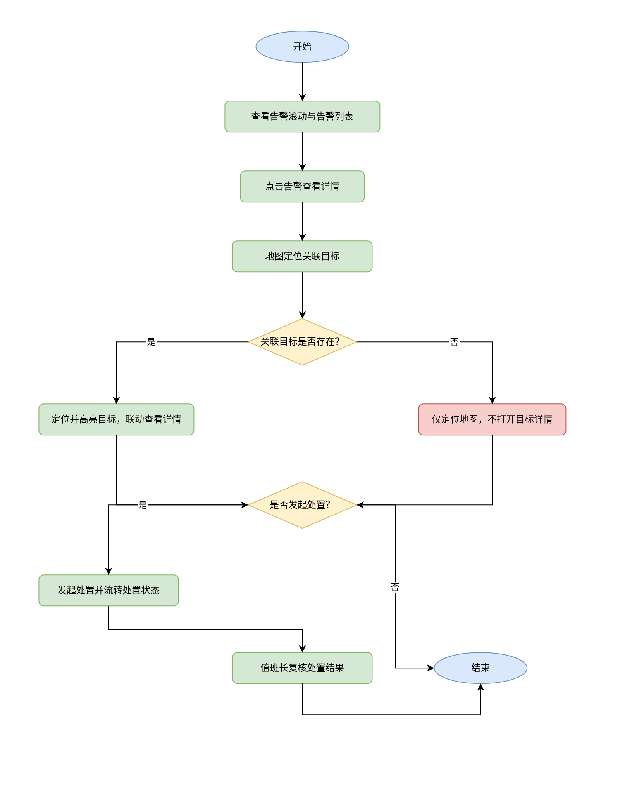

**（五）功能时序图**

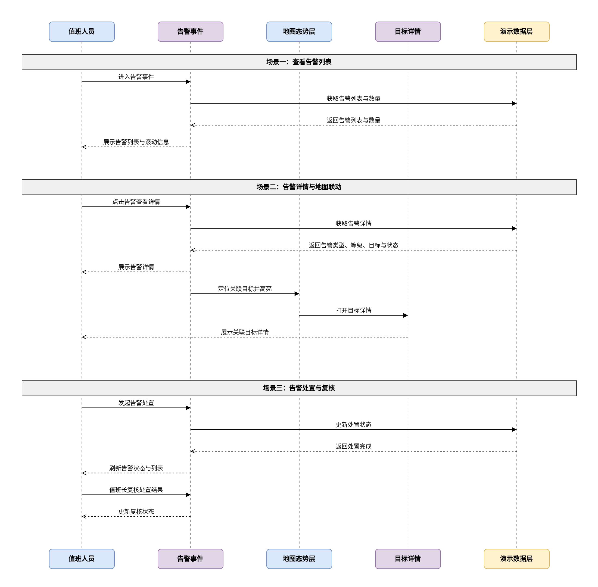

### 3.5.5 工具栏

**（一）功能需求概述**

工具栏集中提供图层切换、目标样式、复位视角、坐标拾取、测距与全屏切换六类视图辅助能力，支持值班人员在不离开海图主视角的情况下调整显示内容、完成坐标与距离研判。工具栏操作即时作用于地图态势层，并与海图交互保持状态一致。

**（二）功能设计**

**图层切换**

图层切换提供目标、轨迹、行政区划、雷达覆盖四个图层的显示与隐藏控制，作为地图态势层图层开关的统一入口。

| 图层 | 默认状态 | 说明 |
|-----|---------|------|
| 目标 | 显示 | 展示融合目标标记 |
| 轨迹 | 显示 | 展示目标最近轨迹 |
| 行政区划 | 显示 | 展示行政区划边界 |
| 雷达覆盖 | 隐藏 | 展示雷达探测覆盖范围 |

**业务规则**

- 工具栏图层切换与地图态势层的图层开关共享同一显示状态，任一位置调整后另一位置同步更新。
- 图层状态变化即时生效，并保留至本次会话结束。
- 目标图层隐藏时，海图不展示目标标记，数量统计与列表仍按完整数据展示。

**目标样式**

目标样式用于调整海图目标标记大小与轨迹尾迹显示方式，满足不同屏幕与演示场景下的可视性要求。

| 样式项 | 可选范围 | 说明 |
|-------|---------|------|
| 标记大小 | 小、中、大 | 调整目标标记尺寸 |
| 轨迹尾迹 | 关闭、短、长 | 调整目标最近轨迹显示长度 |

**业务规则**

- 样式调整即时作用于海图全部目标与轨迹，演示数据刷新后样式保持不变。
- 轨迹尾迹关闭后，海图不展示轨迹线，目标位置与动态信息不受影响。
- 标记大小调整不改变目标选中与聚合逻辑。

**复位视角**

复位视角一键恢复海图默认中心位置与缩放级别，用于值班人员在多次定位、缩放后快速回到辖区全景。

**业务规则**

- 点击复位视角后，海图视角恢复为打开大屏时的默认中心与缩放级别。
- 复位视角不改变图层显示状态、目标样式与当前选中目标。
- 海图数据未加载完成时，复位视角操作不可用。

**坐标拾取**

坐标拾取支持点击海图任意位置获取经纬度坐标，辅助值班人员标注与研判特定位置。

**业务规则**

- 启用坐标拾取后，点击海图返回该点经纬度并展示在当前拾取结果区域。
- 拾取过程中海图平移与缩放仍可使用，操作结果不受影响。
- 再次启用拾取或执行其他视图操作时，前一次拾取结果保留至本次会话结束。

**边界与异常**

- 点击海图空白区域以外的目标标记时，仍返回该位置经纬度，不触发目标选中。
- 拾取结果坐标超出辖区范围时，提示"当前点位不在辖区范围内，请确认坐标有效性"。

**测距**

测距支持在海图上连续点击形成测量折线，并展示分段距离与总距离，用于判断目标间距与航线长度。

**业务规则**

- 点击起点与中间点形成测量折线，连续点击追加测量段。
- 双击或点击结束按钮完成测距，展示总距离。
- 执行测距期间不改变海图目标展示与选中状态。
- 测距完成后可清除测量结果，清除后海图恢复原展示状态。

**边界与异常**

- 仅点击一个点时，不形成有效测距结果，提示"请至少选择两个点位进行测距"。
- 测距过程中切换其他视图操作时，当前测量结果保留，可继续完成或清除。

**全屏切换**

全屏切换用于控制大屏全屏展示与退出全屏，满足值班盯屏与演示汇报两种使用场景。

**业务规则**

- 点击全屏切换后，大屏进入浏览器全屏展示；再次点击退出全屏。
- 全屏状态变化不改变当前图层、目标样式、选中目标与告警列表状态。
- 全屏切换后，1920×1080 等比缩放适配继续生效，内容完整可见。

**边界与异常**

- 当前环境不支持全屏时，提示"当前环境不支持全屏，请使用浏览器全屏能力"。
- 退出全屏后，海图视角与选中状态保持退出前状态。

**（三）业务逻辑关联**

- 图层切换与目标样式作用于地图态势层，其状态与地图态势层的图层开关、目标渲染共享同一数据。
- 复位视角、坐标拾取与测距仅改变海图视角与临时测量信息，不修改目标、轨迹与告警数据。
- 全屏切换作用于大屏容器，切换过程中所有功能模块状态保持不变。

**（四）用户操作流程图**

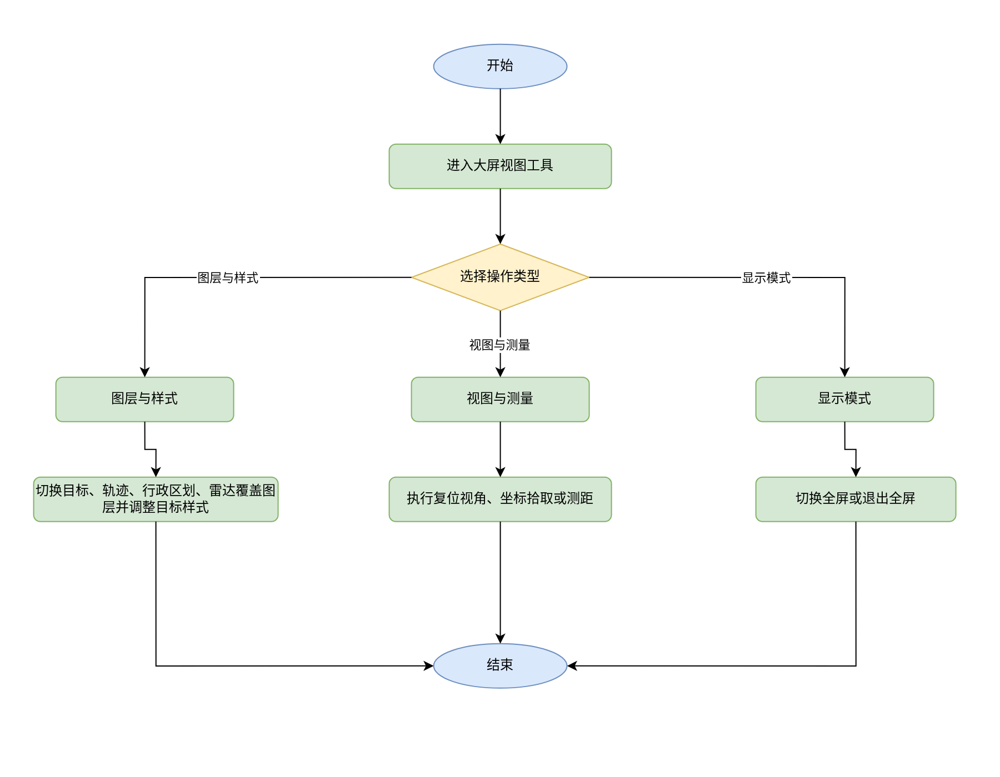

**（五）功能时序图**

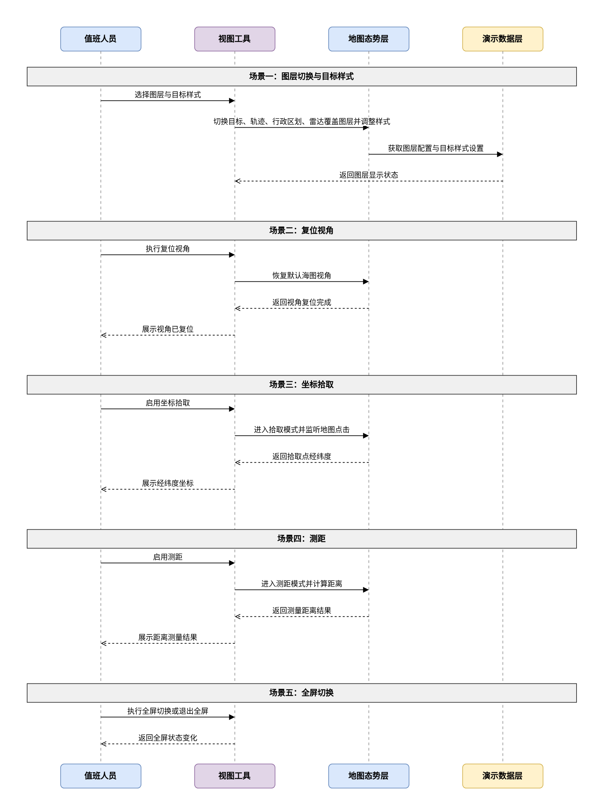

---

## 四、技术方案

### 4.1 技术架构

海上全域感知大屏 v1.0 以浏览器端 Web 应用形式建设，独立全屏入口打开，与现有网站页面隔离。整体由界面层、地图能力与演示数据层三部分构成：

- **系统形态**：PC 端浏览器 Web 应用，按 1920×1080 设计稿等比缩放，窗口比例不符时双轴适配并居中，支持全屏切换。
- **界面层**：地图态势层、目标监控、目标详情、告警事件、视图工具以分区形式组织，共享同一目标选中关系、图层状态与告警状态。
- **地图能力**：采用成熟的 Web 地图渲染能力实现底图、图层叠加、目标绘制、缩放聚合、坐标拾取与测距，支持演示环境离线运行。
- **演示数据层**：内置融合目标、单源上报、轨迹点、告警事件四类数据，按固定周期驱动目标移动、来源上报更新与告警新增，数据层与界面解耦。
- **部署方式**：v1.0 以静态 Web 资源方式部署，不建设独立后端服务，不依赖外部系统在线可用。

### 4.2 数据交互

- 演示数据层按固定周期向界面提供最新数据，界面按需查询与持续获取；刷新失败时沿用最近一次有效数据并提示。
- 数据交互遵循"界面只读展示、业务状态以演示数据层为准"的原则，目标选中、图层状态与视图工具状态不写入演示数据。
- 数据格式约定：融合目标、单源上报、轨迹点、告警事件分别具备唯一标识、时间字段与状态字段，字段口径与第六章数据需求保持一致。
- 后续接入真实 AIS、雷达、北斗数据时，保持字段口径不变，仅替换数据获取方式，界面行为不做调整。

### 4.3 外部系统集成

v1.0 不集成真实 AIS、雷达、北斗数据源，预留统一数据接入位置。接入前无需外部系统在线，演示数据可完整驱动核心链路。

### 4.4 安全方案

- v1.0 不含登录与权限管理，按 3.4 页面访问权限预留角色判定位置，后续迭代接入真实权限体系。
- 演示数据不包含真实目标与敏感业务信息，演示环境与真实环境隔离。
- 全屏展示依赖浏览器全屏能力，仅在用户主动触发时启用，不自动获取额外权限。
- 后续接入真实数据时，数据传输采用加密通道，敏感信息按最小化原则展示，并具备操作审计能力。

---

## 五、非功能需求

### 5.1 性能需求

- **页面加载**：在常规办公网络下，大屏初始内容加载完成时间不超过 3 秒，演示数据随页面一起提供。
- **操作响应**：目标点击、筛选、列表翻页、告警定位等常规操作响应时间不超过 1 秒。
- **数据刷新**：演示数据周期刷新不阻塞界面操作，刷新期间目标选中、列表滚动与筛选条件保持稳定。
- **数据处理**：内置演示数据规模下（融合目标约 200 个、轨迹点约 6000 个、告警事件约 100 条），海图渲染与交互保持流畅。
- **长时间运行**：连续运行 4 小时不出现明显卡顿、数据错乱或界面异常。

### 5.2 安全需求

- 演示数据仅用于功能演示，不包含真实目标、人员与敏感业务信息。
- 全屏、坐标拾取等浏览器能力仅在用户主动操作时触发。
- 后续接入真实数据时，需具备身份认证、权限控制与操作审计能力，v1.0 仅预留设计基线。

### 5.3 可用性需求

- 演示数据刷新失败时，界面保留最近一次有效数据并提示"数据刷新失败，正在使用最近数据"，不中断当前操作。
- 地图加载失败时，目标列表、告警列表等其他功能区域仍可查看演示数据，并提供重试入口。
- 长时间运行状态下，系统时间、告警滚动与数据刷新保持连续可用。
- 系统提供明确的空态、降级态与异常提示，值班人员可识别当前数据状态。

### 5.4 兼容性需求

- **浏览器**：Chrome、Edge 最新稳定版本优先支持，Firefox、Safari 最新版本基本支持。
- **分辨率**：按 1920×1080 设计稿等比缩放，支持 1366×768 及以上分辨率窗口双轴适配。
- **显示环境**：支持单屏大屏与双屏扩展场景，不依赖特定浏览器插件。

---

## 六、数据需求

### 6.1 数据字典

| 枚举类型 | 枚举值 | 说明 |
|---------|-------|------|
| 目标状态 | 在线 | 最近一次有效上报在时效范围内 |
| ^ | 离线 | 最近一次有效上报超过时效范围 |
| ^ | 异常 | 最近一次上报数据质量异常 |
| 目标类型 | 货船 | 货物运输船舶 |
| ^ | 渔船 | 渔业作业船舶 |
| ^ | 客船 | 旅客运输船舶 |
| ^ | 危险品船 | 危险品运输船舶 |
| ^ | 其他 | 其他类型船舶 |
| 数据来源 | AIS | 船舶自动识别系统上报 |
| ^ | 雷达 | 雷达探测上报 |
| ^ | 北斗 | 北斗定位上报 |
| ^ | 多源组合 | 两个及以上来源上报合并 |
| 数据质量 | 高 | 上报完整且可信 |
| ^ | 中 | 上报部分缺失或存在漂移 |
| ^ | 低 | 上报异常或连续缺失 |
| 告警等级 | 紧急 | 需立即关注与处置 |
| ^ | 重要 | 需尽快关注与处置 |
| ^ | 一般 | 常规提醒 |
| 告警类型 | 越界 | 目标超出辖区或围栏范围 |
| ^ | 超速 | 目标航速超过阈值 |
| ^ | 失联 | 目标超过时效无有效上报 |
| ^ | 碰撞风险 | 目标间存在碰撞风险 |
| ^ | 区域告警 | 目标进入敏感区域 |
| 处置状态 | 待处置 | 告警已产生，尚未发起处置 |
| ^ | 处置中 | 值班监控员已发起处置 |
| ^ | 已处置 | 处置操作已完成 |
| ^ | 已复核 | 值班长已复核处置结果 |

### 6.2 数据实体说明

| 数据实体 | 关键字段 | 说明 |
|---------|---------|------|
| 融合目标 | 目标标识、名称、MMSI、类型、状态、经纬度、航速、航向、更新时间 | 多来源上报合并后的统一目标 |
| 单源上报 | 上报标识、目标标识、来源、上报时间、数据质量、位置 | 单个来源对目标的最近一次上报 |
| 轨迹点 | 轨迹标识、目标标识、时间、位置、航速、航向 | 目标按时间顺序的航迹记录 |
| 告警事件 | 告警标识、关联目标、告警类型、等级、发生时间、处置状态 | 驱动告警滚动与处置流转的事件记录 |

### 6.3 数据存储要求

- v1.0 演示数据在浏览器运行期间保存在内存中，关闭大屏后不保留，不涉及真实数据落盘。
- 演示数据初始规模：融合目标约 200 个、轨迹点约 6000 个、告警事件约 100 条。
- 数据刷新策略：目标位置按固定周期更新，来源上报时间滚动更新，告警按时间流新增并达到上限后滚动。
- 后续接入真实数据时，数据保留期限与归档策略由数据接入方确定，不在 v1.0 范围内。

---

## 七、数据交互需求

### 7.1 演示数据层对外行为

- **查询行为**：按目标标识、筛选条件、时间范围提供融合目标、单源上报、轨迹点、告警事件的查询结果，查询结果与界面展示口径一致。
- **持续获取行为**：按固定周期向界面提供目标动态、来源状态与新增告警，获取结果不覆盖当前选中目标，仅更新其动态信息。
- **状态同步**：目标选中、图层状态、目标样式与视图工具状态等界面状态不写入演示数据，演示数据只负责业务数据。
- **异常行为**：数据缺失、超时或刷新失败时，返回最近一次有效数据并附带状态说明，界面按第五章可用性需求提示。

### 7.2 真实数据接入约定

- 真实 AIS、雷达、北斗数据接入时，字段口径与第六章数据需求保持一致，仅替换数据获取方式，界面行为不做调整。
- 告警事件由数据接入侧提供，或由融合目标状态按告警类型规则计算产生，产生规则以第六章数据字典为准。
- 接入后的数据保留期限与归档策略由数据接入方确定，v1.0 不做约束。

---

## 八、项目实施与验收

### 8.1 实施阶段

1. **需求确认阶段**（1周）：需求评审、原型确认、需求基线锁定。
2. **原型开发阶段**（按交付计划推进）：大屏基础框架、演示数据层、地图态势层、目标监控、目标详情、告警事件、工具栏、整体收尾。
3. **演示验证阶段**（1周）：全链路演示、异常场景验证、视觉与交互验收。
4. **验收交付阶段**（1周）：功能验收、文档交付、真实数据接入规划。

### 8.2 系统培训服务

- **培训对象**：值班监控员、值班长、指挥调度人员、系统管理员。
- **培训内容**：大屏操作、目标筛选与详情查看、告警处置与复核、视图工具、演示数据维护。
- **培训方式**：现场演示、操作手册、常见问题解答。

### 8.3 验收标准

- **功能验收**：第三章全部功能按需求实现，无 P0/P1 级缺陷。
- **场景验收**：以内置演示数据完整跑通"海图态势 → 目标监控 → 目标详情 → 告警事件 → 视图工具"核心链路。
- **适配验收**：1920×1080 等比缩放正确，窗口比例变化时内容完整可见且不重叠。
- **文档验收**：提供 SRS、设计方案、交付计划与操作手册。

---

## 九、附录

### 附录A：术语表

| 术语 | 说明 |
|-----|------|
| AIS | 船舶自动识别系统，用于获取船舶静态与动态信息 |
| MMSI | 海上移动通信标识，用于唯一标识船舶 |
| 雷达 | 雷达探测手段，用于获取目标位置与运动信息 |
| 北斗 | 北斗卫星导航定位手段，用于获取目标位置与状态 |
| 融合目标 | 多来源上报合并后的统一目标 |
| 聚合 | 地图缩放时多个目标合并为一个标记展示 |
| 数据质量 | 单源上报的完整度与可信程度 |
| 处置状态 | 告警处置流程所处阶段 |
| SRS | 软件需求规格说明书 |

### 附录B：参考资料

- 原项目功能与界面（仅作参考，不修改原项目代码）。
- 海上全域感知大屏设计方案。
- 海上全域感知大屏交付计划。
